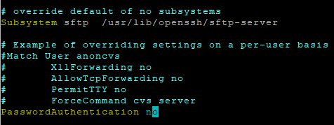
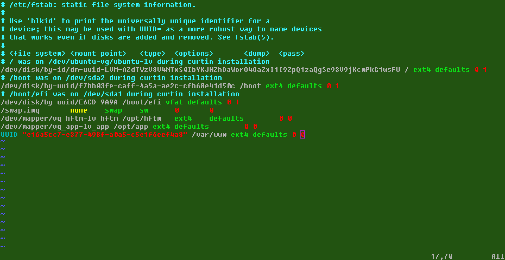
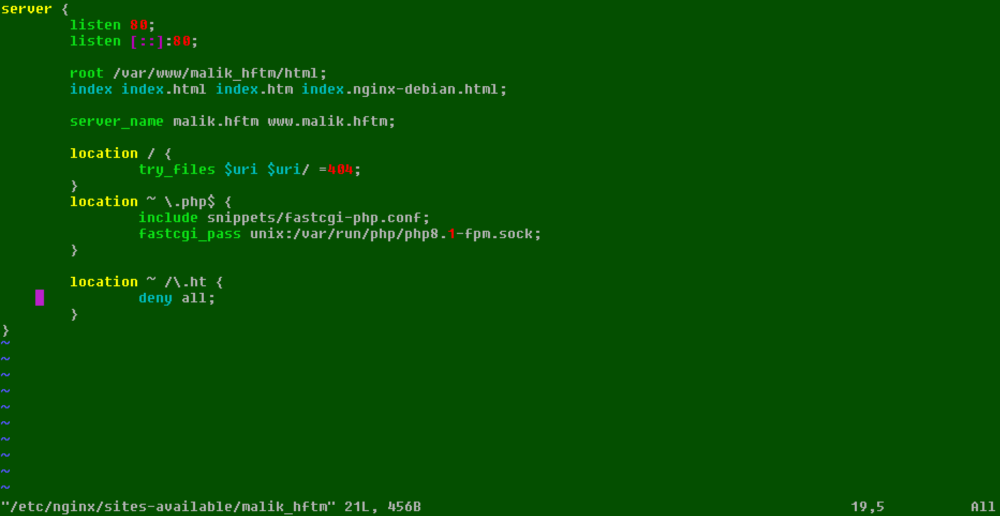
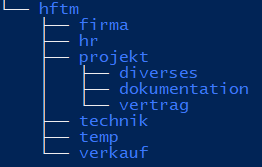
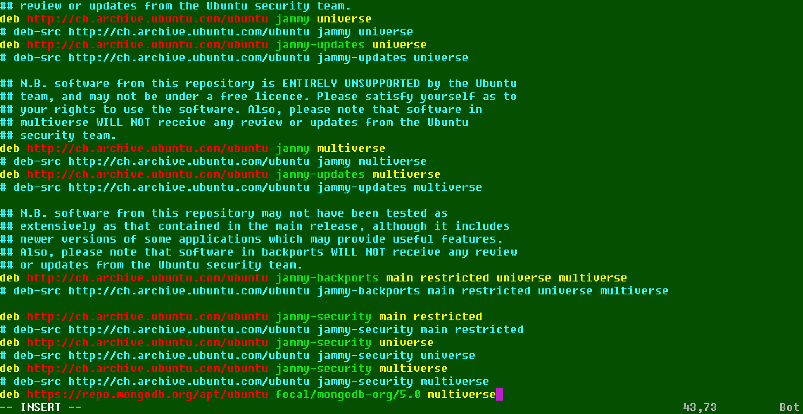

**Workbook IN202**
==================

SSH Authentication config
===========================

## 1. create ssh key on client (ssh-keygen)

 ### Flags:

>-t = type, select algorithm  
-e = export, reformat  
-f, = filename/location  
-c, = comment  
-b = bits, key size 
-p = change passphrase(-N, new;-P, old)  
-i, = input  
-q, = silent ssh  

### input

>ssh-keygen -t rsa -b 4096 -C "comment"

## 2.1 copy public key to ubuntu server (ssh-id-copy)

### command

>ssh-copy-id "username@remote_host"

## 2.2 copy public key to ubuntu server (ssh, used if no ssh-id-copy)

### input

>cat ~/.ssh/id_rsa.pub | ssh username@remote_host "mkdir -p ~/.ssh && touch ~/.ssh/authorized_keys && chmod -R go= ~/.ssh && cat >> ~/.ssh/authorized_keys"

## 3.1 check that user has sudo privileges

### input

>id "username"

If the user is not in the sudo group on remote-server input the following

>sudo usermod -aG sudo "username"

## 3.2 disable password authentication

### input

>sudo vim /etc/ssh/sshd_config

un-comment PasswordAuthentication and set it to "no"



## 4 restart ssh service

### input

>sudo service ssh restart

## Failed attempt to connect without pub key

### output

<pre>
test@hv-ubnt02:~$ ssh user1@192.168.22.139 -p 22
The authenticity of host '192.168.22.139 (192.168.22.139)' can't be established.
ED25519 key fingerprint is SHA256:hhNG05OeTVyok63zhYF4VeNWSQFwL2G22dZbPw3pFEY.
This key is not known by any other names
Are you sure you want to continue connecting (yes/no/[fingerprint])? yes
Warning: Permanently added '192.168.22.139' (ED25519) to the list of known hosts.
user@192.168.22.139: Permission denied (publickey).
</pre>

not able to connect, pubkeyAuthentication is working


Disks and Partitions
=====================

## A. Number, size, fstype and UUID of disks and partitions


**input**


>sudo lsblk -o NAME,FSTYPE,SIZE,MOUNTPOINT,TYPE,UUID

**alternative**
>sudo fdisk -l

**only UUID**
>sudo blkid | grep UUID=

*with grep, sort and pipes its possible to get the needed values quickly*
<>
**output**
<!-- <pre> -->


```
NAME                      FSTYPE       SIZE MOUNTPOINT        TYPE UUID
loop3                     squashfs    49.8M /snap/snapd/17950 loop
sda                                     30G                   disk
├─sda1                    vfat           1G /boot/efi         part E6CD-9A9A
├─sda2                    ext4           2G /boot             part f7bb03fe-caff-4a5a-ae2c-cfb68e41d50c
└─sda3                    LVM2_member 26.9G                   part riEBMK-fIxx-Noup-V4kU-t5H8-mVIF-yyBQX0
  └─ubuntu--vg-ubuntu--lv ext4        13.5G /                 lvm  accbbe4e-bf45-433b-8803-e291e01788db
sdb                                     20G                   disk
└─sdb1                    LVM2_member   20G                   part mKFq8i-TIcd-KV9G-7PKG-P0Kq-j1bG-SINesf
  └─vg_hftm-lv_hftm       ext4          20G /opt/hftm         lvm  f740664a-b89a-4d08-a83e-be4e0526e329
sdc                                      5G                   disk
└─sdc1                    LVM2_member    5G                   part JZrU7K-E0g1-fv24-I3zO-fp3P-N9lu-YOTrb2
  └─vg_app-lv_app         ext4           5G /opt/app          lvm  f663b9c2-ed67-4f80-9389-a5eb683d53d4
sdd                                      5G                   disk
└─sdd1                    LVM2_member    5G                   part RAIn0z-AvVR-PEAF-Gi6T-I47K-UEfE-JdiaA6
  └─vg_www-lv_www         ext4           5G /var/www          lvm  e16a5cc7-e377-498f-a0a5-c5e1f6eef4a8
sr0                                   1024M                   rom
```

## 1. Create 2 seperate 5GB virtual drives

In Hyper-V-Manager --> new --> Harddisk
- VHDX
- fixed size
- named so I know what's the use for them (www_ubnt and app_ubnt)

For maintaining overview of virtual disks and their names on the server, I did the following steps first only with one virtual disk connected to the vm. Only then I connected the second and repeated the steps for it. *(Only in part 2.1)*

## 2.1 partition the drive with fdisk

first list drives and check for the correct disk then use:

>fdisk /dev/sdc  

1. n --> creates new partition
2. p --> primary
3. partition number: default
4. first sector: default
5. last sector: default (max. size)
6. t --> type of partition
7. for LVM --> 8e (L to list all codes)
8. w --> write changes

*check if lvm2 is installed!*

## 2.2 add LVM, create filesystem

**1.** create physical volume

>sudo pvcreate /dev/sdc1  
sudo pvcreate /dev/sdd1  

**2.** create volume groups on pv

>sudo vgcreate vg_app /dev/sdc1  
sudo vgcreate vg_www /dev/sdd1  

**3.** create logical volumes

>sudo lvcreate -l 100%FREE -n lv_app vg_app    
sudo lvcreate -l 100%FREE -n lv_www vg_www    

**4.** create filesystem

>sudo mkfs.ext4 /dev/vg_app/lv_app  
sudo mkfs.ext4 /dev/vg_www/lv_www  

## 2.3 mount disk permanently

**1.** create mount points

>sudo mkdir /opt/app  
sudo mkdir /var/www

**2.** add the disks to /etc/fstab

*a) preparation*
 - for lv_app copy /dev/mapper path to notepad  
 - for lv_www copy UUID to notepad

*b) map the filestystems with the mountpoints*
>sudo vim /etc/fstab

syntax of fstab
```
# <file system> <mount point>   <type>  <options>       <dump>  <pass>
```

*input*
```
/dev/mapper/vg_app-lv_app /opt/app ext4 defaults        0 0  
UUID="e16a5cc7-e377-498f-a0a5-c5e1f6eef4a8" /var/www ext4 defaults 0 0  
```



*c) unmount all disks then remount all, then check if the disks added*  
*to fstab got mounted*

```
sudo umount -a
sudo mount -a
sudo mount -l
```
LEMP
====

I chose the LEMP stack as it uses Nginx and not Apache, i don't plan to host multiple sites so I don't need Apache and with Nginx i got a webserver that is more efficient than Apache in handling requests.

## **1. setup**

**A.) install Nginx**

>sudo apt install nginx

**A.1) add Nginx HTTP to ufw**

>sudo ufw allow 'Nginx HTTP'

*check status*

>sudo ufw status

next I created a folder for my domain

>sudo mkdir /var/www/malik_hftm

and then I gave the console user ownership of the directory
>sudo chown -R $USER:$USER /var/www/malik_hftm

now I need to create a config. file for my domain.  
php processor already included

>sudo vim /etc/nginx/sites-available/malik_hftm

```
server {
        listen 80;
        listen [::]:80;

        root /var/www/malik_hftm/html;
        index index.html index.htm index.nginx-debian.html;

        server_name malik.hftm www.malik.hftm;

        location / {
                try_files $uri $uri/ =404;
        }
        location ~ \.php$ {
                include snippets/fastcgi-php.conf;
                fastcgi_pass unix:/var/run/php/php8.1-fpm.sock;
        }

        location ~ /\.ht {
                deny all;
        }
}
```



now I activated the config by linking it to /etc/nginx/sites-enabled/
>sudo ln -s /etc/nginx/sites-available/malik_hftm /etc/nginx/sites-enabled/

reload Nginx

>sudo systemctl reload nginx

**B.) install MySQL**

>sudo apt install mysql-server

now I want to make the MySQL installation secure by runing the "mysql_secure_installation" script.
The script is included in the installation of MySQL-Server.

But before I use the script I need to change the MySQL auth. method and the SQL root password.
This is needed as the script will produce an error if this change is not done before.

After the script is done, I will need change the auth. method back to "auth_socket"

**B.1) change MySQL auth. method and run secure_installation script**

1. >sudo mysql
   
2. >ALTER USER 'root'@'localhost' IDENTIFIED WITH mysql_native_password BY '**YOUR_PASSWORD**';
   
3. exit MySQL console
   
4. >sudo mysql_secure_installation
  - script will ask to enable VALIDATE PASSWORD PLUGIN
  only enable if explicitly needed
  - everything else can be passed with "y"

1. back to MySQL console to change auth. method
   >sudo mysql -u root -p

2. >ALTER USER 'root'@'localhost' IDENTIFIED WITH auth_socket;

**C.) install PHP fastCGI process manager (fpm)**

1. >sudo apt install php8.1-fpm php-mysql

## 2. testing


**php**

for testing I created the following .php file in /var/www/malik_hftm/html

- info.php

```
<?php
phpinfo();
```

by going to http://malik.hftm/info.php I can verify that the php processor is working correctly if the .php file is shown correctly

**MySQL**

the test of MySQL needs an example user and an example database

1. login to mysql
2.  >CREATE DATABASE example_database;
3.  >CREATE USER 'example_user'@'%' IDENTIFIED WITH mysql_native_password BY 'password';
4.  >GRANT ALL ON example_database.* TO 'example_user'@'%';
5.  exit mysql console

now I logged in with the example user to put a table and some data in the database

1. >mysql -u example_user -p
2. create table
  ```
    CREATE TABLE example_database.todo_list (
    item_id INT AUTO_INCREMENT,
    content VARCHAR(255),
    PRIMARY KEY(item_id)
    );
  ```
3. insert data into table
  >INSERT INTO example_database.todo_list (content) VALUES ("My first important item");

  with the follwoing command its possible to check the created table

  >SELECT * FROM example_database.todo_list;

4. create .php script to access MySQL database
>sudo vim /var/www/malik_hftm//html/todo_list.php

```
<?php
$user = "example_user";
$password = "password";
$database = "example_database";
$table = "todo_list";

try {
  $db = new PDO("mysql:host=localhost;dbname=$database", $user, $password);
  echo "<h2>TODO</h2><ol>"; 
  foreach($db->query("SELECT content FROM $table") as $row) {
    echo "<li>" . $row['content'] . "</li>";
  }
  echo "</ol>";
} catch (PDOException $e) {
    print "Error!: " . $e->getMessage() . "<br/>";
    die();
}
```

5. http://malik.hftm/todo_list.php to check if the table is shown

6. ?????

7. profit

User management
===============

## 1. create groups

**groups:**

```
- Technik
- Verkauf
- HR
- Projekt
- Firma
```
*input*

```
malik@hv-ubnt:~$ sudo groupadd Technik  
malik@hv-ubnt:~$ sudo groupadd Verkauf  
malik@hv-ubnt:~$ sudo groupadd HR  
malik@hv-ubnt:~$ sudo groupadd Projekt  
malik@hv-ubnt:~$ sudo groupadd Firma
```

check if groups got created

```
malik@hv-ubnt:~$ sudo getent group | grep 'Technik\|Verkauf\|HR\|Projekt\|Firma'  
Technik:x:1002:  
Verkauf:x:1003:  
HR:x:1004:  
Projekt:x:1005:  
Firma:x:1006:  
```

## 2. create users

```
- Hans, G: Technik
- Peter,  G: Verkauf
- Alfred, G: Verkauf
- Georg , G: HR, Projekt
- Markus, G: HR
- Albert, G: Projekt
- Christne, G: Technik, Projekt
- Beate, G: Technik, Verkauf, HR, Projekt
```

with useradd I'm also defining the main group (-g) as well as additionl groups (-G) for each user as well as creating a home-directory (-m) and choosing which shell each user uses (-s)

*input*
```
malik@hv-ubnt:~$  sudo useradd -g Firma -G Technik -m -s /bin/bash Hans  
malik@hv-ubnt:~$  sudo useradd -g Firma -G Verkauf -m -s /bin/bash Peter    
malik@hv-ubnt:~$  sudo useradd -g Firma -G Verkauf -m -s /bin/bash Alfred  
malik@hv-ubnt:~$  sudo useradd -g Firma -G HR,Projekt -m -s /bin/bash Georg  
malik@hv-ubnt:~$  sudo useradd -g Firma -G HR -m -s /bin/bash Markus     
malik@hv-ubnt:~$  sudo useradd -g Firma -G Projekt -m -s /bin/bash Albert   
malik@hv-ubnt:~$  sudo useradd -g Firma -G Technik,Projekt -m -s /bin/bash Christine  
malik@hv-ubnt:~$  sudo useradd -g Firma -G Technik,Verkauf,HR,Projekt -m -s /bin/bash Beate  
```
second step is to create passwords {USERNAME123}

```
malik@hv-ubnt:~$ sudo passwd Hans
New password:
Retype new password:
passwd: password updated successfully
```
repeated for each user


check if all users got created and list their groups

>malik@hv-ubnt:~$ sudo groups Hans Peter Alfred Georg Markus Albert Christine Beate  
Hans : Firma Technik  
Peter : Firma Verkauf  
Alfred : Firma Verkauf  
Georg : Firma HR Projekt  
Markus : Firma HR  
Albert : Firma Projekt  
Christine : Firma Technik Projekt  
Beate : Firma Technik Verkauf HR Projekt  

## 3. create directory tree



```
malik@hv-ubnt:~$ sudo mkdir -p /opt/hftm/{firma,hr,projekt,technik,temp,verkauf}  
malik@hv-ubnt:~$  sudo mkdir -p /opt/hftm/projekt/{diverses,dokumentation,vertrag}
```

check tree

```
malik@hv-ubnt:~$ sudo ls /opt/hftm/ -l
total 40
drwxr-xr-x 2 root root  4096 Feb  6 18:48 firma
drwxr-xr-x 2 root root  4096 Feb  6 18:48 hr
drwx------ 2 root root 16384 Jan 28 08:11 lost+found
drwxr-xr-x 5 root root  4096 Feb  6 18:51 projekt
drwxr-xr-x 2 root root  4096 Feb  6 18:48 technik
drwxr-xr-x 2 root root  4096 Feb  6 18:48 temp
drwxr-xr-x 2 root root  4096 Feb  6 18:48 verkauf
malik@hv-ubnt:~$ sudo ls /opt/hftm/projekt -l
total 12
drwxr-xr-x 2 root root 4096 Feb  6 18:51 diverses
drwxr-xr-x 2 root root 4096 Feb  6 18:51 dokumentation
drwxr-xr-x 2 root root 4096 Feb  6 18:51 vertrag
malik@hv-ubnt:~$
```

## 4. manage permissions

```
- least privileges
- all folders user root --> owner
- group with same name as folder --> owner and rwx
- Hans --> account locked 5 days after password expires
- Markus --> r on verkauf
- all --> create files in temp, only delete own files
- Technik inhert to all new folders and files in folder technik (SGID)
```

### least privileges

changing the permissions for the others group so only members of the folder-group can access the folder

for folder "technik" I'm using SGID so all new files and folders inherit the permissions of the group

```
malik@hv-ubnt:~$ sudo chmod 2770 /opt/hftm/technik  
malik@hv-ubnt:~$ sudo chmod 0770 /opt/hftm/verkauf  
malik@hv-ubnt:~$ sudo chmod 0770 /opt/hftm/hr  
malik@hv-ubnt:~$ sudo chmod 0770 /opt/hftm/projekt  
malik@hv-ubnt:~$ sudo chmod 0770 /opt/hftm/firma
```

for the folder "temp" i will use a sticky bit so only owners of a file can delete it

>malik@hv-ubnt:~$ sudo chmod +t /opt/hftm/temp

### change group of folders

```
malik@hv-ubnt:~$ sudo chgrp Firma /opt/hftm/firma  
malik@hv-ubnt:~$ sudo chgrp Technik /opt/hftm/technik  
malik@hv-ubnt:~$ sudo chgrp Verkauf /opt/hftm/verkauf  
malik@hv-ubnt:~$ sudo chgrp HR /opt/hftm/hr  
malik@hv-ubnt:~$ sudo chgrp Projekt /opt/hftm/projekt  
malik@hv-ubnt:~$ sudo chgrp Firma /opt/hftm/temp
```

check group

```
malik@hv-ubnt:~$ sudo ls /opt/hftm/ -l
total 40
drwxr-xr-x 2 root Firma    4096 Feb  6 18:48 firma
drwxr-xr-x 2 root HR       4096 Feb  6 18:48 hr
drwx------ 2 root root    16384 Jan 28 08:11 lost+found
drwxr-xr-x 5 root Projekt  4096 Feb  6 18:51 projekt
drwxr-xr-x 2 root Technik  4096 Feb  6 18:48 technik
drwxr-xr-x 2 root Firma     4096 Feb  6 18:48 temp
drwxr-xr-x 2 root Verkauf  4096 Feb  6 18:48 verkauf
```

### lock account from Hans 5 days after password expires

for password expiration information use chage

synopsis:
>**chage** [options] [LOGIN]

flags:

```
-d, --lastday LAST_DAY

Set the number of days since January 1st, 1970 when the password was last changed. The date may also be expressed in the format YYYY-MM-DD (or the format more commonly used in your area). 

-E, --expiredate EXPIRE_DATE

  Set the date or number of days since January 1, 1970 on which the user's account will no longer be accessible. The date may also be expressed in the format YYYY-MM-DD (or the format more commonly used in your area). A user whose account is locked must contact the system administrator before being able to use the system again.

  Passing the number -1 as the EXPIRE_DATE will remove an account expiration date. 

-h, --help

  Display help message and exit. 

-I, --inactive INACTIVE

  Set the number of days of inactivity after a password has expired before the account is locked. The INACTIVE option is the number of days of inactivity. A user whose account is locked must contact the system administrator before being able to use the system again.

  Passing the number -1 as the INACTIVE will remove an account's inactivity. 

-l, --list

  Show account aging information.

-m, --mindays MIN_DAYS

  Set the minimum number of days between password changes to MIN_DAYS. A value of zero for this field indicates that the user may change his/her password at any time.

-M, --maxdays MAX_DAYS

  Set the maximum number of days during which a password is valid. When MAX_DAYS plus LAST_DAY is less than the current day, the user will be required to change his/her password before being able to use his/her account. This occurrence can be planned for in advance by use of the -W option, which provides the user with advance warning.

  Passing the number -1 as MAX_DAYS will remove checking a password's validity. 

-W, --warndays WARN_DAYS

  Set the number of days of warning before a password change is required. The WARN_DAYS option is the number of days prior to the password expiring that a user will be warned his/her password is about to expire. 

If none of the options are selected, chage operates in an interactive fashion, prompting the user with the current values for all of the fields. Enter the new value to change the field, or leave the line blank to use the current value. The current value is displayed between a pair of [ ] marks. 
```

**input**

```
malik@hv-ubnt:~$ sudo chage -E 2023-02-08 -I 5 Hans
```

check status:

```
malik@hv-ubnt:~$ sudo chage -l Hans  
Last password change                                    : Feb 06, 2023  
Password expires                                        : never  
Password inactive                                       : never  
Account expires                                         : Feb 08, 2023  
Minimum number of days between password change          : 0  
Maximum number of days between password change          : 99999  
Number of days of warning before password expires       : 7  
```

### Markus read on verkauf

here I will use setfacl to change the permissions without changing the owner of the folder. I also need to give Markus exectue permission so he can enter the folder

```
malik@hv-ubnt:~$ sudo setfacl -m u:Markus:rx /opt/hftm/verkauf  
```

check if permission is granted

```
malik@hv-ubnt:~$ sudo getfacl /opt/hftm/verkauf
getfacl: Removing leading '/' from absolute path names
# file: opt/hftm/verkauf
# owner: root
# group: Verkauf
user::rwx
user:Markus:r-x
group::rwx
mask::rwx
other::---
```

## testing

### seeing if I only have access to the specified folders for each user

```
malik@hv-ubnt:~$ su Hans
Password:
Hans@hv-ubnt:~$ cd /opt/hftm
Hans@hv-ubnt:/opt/hftm ls
firma  hr  lost+found  projekt  technik  temp  verkauf
Hans@hv-ubnt:/opt/hftm$ cd hr/
bash: cd: hr/: Permission denied
Hans@hv-ubnt:/opt/hftm$ cd firma
Hans@hv-ubnt:/opt/hftm/firma$ cd ../projekt/
bash: cd: ../projekt/: Permission denied
Hans@hv-ubnt:/opt/hftm/firma$ cd ../technik
Hans@hv-ubnt:/opt/hftm/technik$ cd ../verkauf
bash: cd: ../verkauf: Permission denied
Hans@hv-ubnt:/opt/hftm/technik$ cd ../temp
Hans@hv-ubnt:/opt/hftm/temp$
```

Hans only has access to the his permitted folders

### temp folder functionality

create 3 files with Hans

```
Hans@hv-ubnt:/opt/hftm/temp$ touch hans1 hans2 hans3
Hans@hv-ubnt:/opt/hftm/temp$ ls
hans1  hans2  hans3
```

delete one file with Hans

```
Hans@hv-ubnt:/opt/hftm/temp$ ls
hans1  hans2  hans3
Hans@hv-ubnt:/opt/hftm/temp$ rm hans2
Hans@hv-ubnt:/opt/hftm/temp$ ls
hans1  hans3
```

try to delete a file created by Hans with Markus

```
Markus@hv-ubnt:/opt/hftm/temp$ ls
hans1  hans3
Markus@hv-ubnt:/opt/hftm/temp$ rm hans1
rm: remove write-protected regular empty file 'hans1'? yes
rm: cannot remove 'hans1': Operation not permitted
```

### see if Markus can read folder 'verkauf'

For this I created a file with Peter

```
Peter@hv-ubnt:/opt/hftm$ cd verkauf/
Peter@hv-ubnt:/opt/hftm/verkauf$ touch testfuermarkus
Peter@hv-ubnt:/opt/hftm/verkauf$ vim testfuermarkus
```

now I try to read the file with Markus then I see if I can delete it

```
Markus@hv-ubnt:/opt/hftm/verkauf$ cat testfuermarkus
funktioniert es?

ja es funktioniert!
Markus@hv-ubnt:/opt/hftm/verkauf$ rm testfuermarkus
rm: remove write-protected regular file 'testfuermarkus'? yes
rm: cannot remove 'testfuermarkus': Permission denied
```

### check if folder "technik" SGID is set correctly

For this I will create folders and files and check the permissions


```
Hans@hv-ubnt:/opt/hftm/technik$ mkdir test1
Hans@hv-ubnt:/opt/hftm/technik$ touch testfile1
Hans@hv-ubnt:/opt/hftm/technik$ cd test1/
Hans@hv-ubnt:/opt/hftm/technik/test1$ mkdir test2
Hans@hv-ubnt:/opt/hftm/technik/test1$ touch testfile2
----------------------------------------------------------
Hans@hv-ubnt:/opt/hftm/technik$ ls -l
total 4
drwxr-sr-x 3 Hans Technik 4096 Feb  7 14:59 test1
-rw-r--r-- 1 Hans Technik    0 Feb  7 14:59 testfile1
----------------------------------------------------------
Hans@hv-ubnt:/opt/hftm/technik$ cd test1/
Hans@hv-ubnt:/opt/hftm/technik/test1$ ls -l
total 4
drwxr-sr-x 2 Hans Technik 4096 Feb  7 14:59 test2
-rw-r--r-- 1 Hans Technik    0 Feb  7 14:59 testfile2
```

Package management
==================


## add baseurl to /etc/apt/sources.list

>sudo vim /etc/apt/sources.list

https://repo.mongodb.org/apt/ubuntu focal/mongodb-org/5.0 multiverse



## add gpg key

> wget -qO- https://www.mongodb.org/static/pgp/server-5.0.asc | sudo apt-key add -

## install mongod

>sudp apt install mongod


