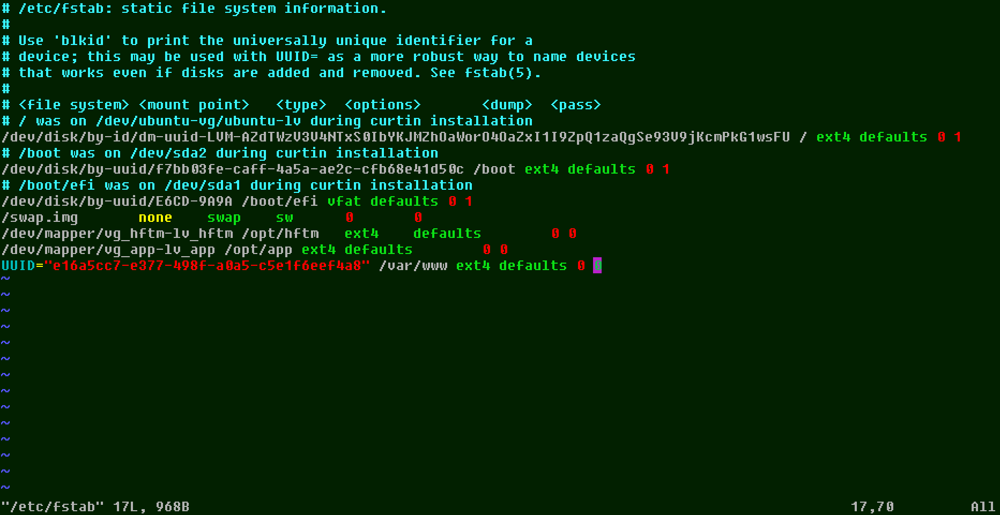

**Workbook IN202**
==================

SSH Authentication config
===========================

## 1. create ssh key on client (ssh-keygen)

 ### Flags:

>-t = type, select algorithm  
-e = export, reformat  
-f, = filename/location  
-c, = comment  
-b = bits, key size 
-p = change passphrase(-N, new;-P, old)  
-i, = input  
-q, = silent ssh  

### input

>ssh-keygen -t rsa -b 4096 -C "comment"

## 2.1 copy public key to ubuntu server (ssh-id-copy)

### command

>ssh-copy-id "username@remote_host"

## 2.2 copy public key to ubuntu server (ssh, used if no ssh-id-copy)

### input

>cat ~/.ssh/id_rsa.pub | ssh username@remote_host "mkdir -p ~/.ssh && touch ~/.ssh/authorized_keys && chmod -R go= ~/.ssh && cat >> ~/.ssh/authorized_keys"

## 3.1 check that user has sudo privileges

### input

>id "username"

If the user is not in the sudo group on remote-server input the following

>sudo usermod -aG sudo "username"

## 3.2 disable password authentication

### input

>sudo vim /etc/ssh/sshd_config

un-comment PasswordAuthentication and set it to "no"


## 4 restart ssh service

### input

>sudo service ssh restart

## Failed attempt to connect without pub key

### output

<pre>
test@hv-ubnt02:~$ ssh user1@192.168.22.139 -p 22
The authenticity of host '192.168.22.139 (192.168.22.139)' can't be established.
ED25519 key fingerprint is SHA256:hhNG05OeTVyok63zhYF4VeNWSQFwL2G22dZbPw3pFEY.
This key is not known by any other names
Are you sure you want to continue connecting (yes/no/[fingerprint])? yes
Warning: Permanently added '192.168.22.139' (ED25519) to the list of known hosts.
user@192.168.22.139: Permission denied (publickey).
</pre>

not able to connect, pubkeyAuthentication is working


Disks and Partitions
=====================

## A. Number, size, fstype and UUID of disks and partitions


**input**


>sudo lsblk -o NAME,FSTYPE,SIZE,MOUNTPOINT,TYPE,UUID

**alternative**
>sudo fdisk -l

**only UUID**
>sudo blkid | grep UUID=

*with grep, sort and pipes its possible to get the needed values quickly*
<>
**output**
<!-- <pre> -->


```
NAME                      FSTYPE       SIZE MOUNTPOINT        TYPE UUID
loop3                     squashfs    49.8M /snap/snapd/17950 loop
sda                                     30G                   disk
├─sda1                    vfat           1G /boot/efi         part E6CD-9A9A
├─sda2                    ext4           2G /boot             part f7bb03fe-caff-4a5a-ae2c-cfb68e41d50c
└─sda3                    LVM2_member 26.9G                   part riEBMK-fIxx-Noup-V4kU-t5H8-mVIF-yyBQX0
  └─ubuntu--vg-ubuntu--lv ext4        13.5G /                 lvm  accbbe4e-bf45-433b-8803-e291e01788db
sdb                                     20G                   disk
└─sdb1                    LVM2_member   20G                   part mKFq8i-TIcd-KV9G-7PKG-P0Kq-j1bG-SINesf
  └─vg_hftm-lv_hftm       ext4          20G /opt/hftm         lvm  f740664a-b89a-4d08-a83e-be4e0526e329
sdc                                      5G                   disk
└─sdc1                    LVM2_member    5G                   part JZrU7K-E0g1-fv24-I3zO-fp3P-N9lu-YOTrb2
  └─vg_app-lv_app         ext4           5G /opt/app          lvm  f663b9c2-ed67-4f80-9389-a5eb683d53d4
sdd                                      5G                   disk
└─sdd1                    LVM2_member    5G                   part RAIn0z-AvVR-PEAF-Gi6T-I47K-UEfE-JdiaA6
  └─vg_www-lv_www         ext4           5G /var/www          lvm  e16a5cc7-e377-498f-a0a5-c5e1f6eef4a8
sr0                                   1024M                   rom
```

## 1. Create 2 seperate 5GB virtual drives

In Hyper-V-Manager --> new --> Harddisk
- VHDX
- fixed size
- named so I know what's the use for them (www_ubnt and app_ubnt)

For maintaining overview of virtual disks and their names on the server, I did the following steps first only with one virtual disk connected to the vm. Only then I connected the second and repeated the steps for it. *(Only in part 2.1)*

## 2.1 partition the drive with fdisk

first list drives and check for the correct disk then use:

>fdisk /dev/sdc  

1. n --> creates new partition
2. p --> primary
3. partition number: default
4. first sector: default
5. last sector: default (max. size)
6. t --> type of partition
7. for LVM --> 8e (L to list all codes)
8. w --> write changes

*check if lvm2 is installed!*

## 2.2 add LVM, create filesystem

**1.** create physical volume

>sudo pvcreate /dev/sdc1  
sudo pvcreate /dev/sdd1  

**2.** create volume groups on pv

>sudo vgcreate vg_app /dev/sdc1  
sudo vgcreate vg_www /dev/sdd1  

**3.** create logical volumes

>sudo lvcreate -l 100%FREE -n lv_app vg_app    
sudo lvcreate -l 100%FREE -n lv_www vg_www    

**4.** create filesystem

>sudo mkfs.ext4 /dev/vg_app/lv_app  
sudo mkfs.ext4 /dev/vg_www/lv_www  

## 2.3 mount disk permanently

**1.** create mount points

>sudo mkdir /opt/app  
sudo mkdir /var/www

**2.** add the disks to /etc/fstab

*a) preparation*
 - for lv_app copy /dev/mapper path to notepad  
 - for lv_www copy UUID to notepad

*b) map the filestystems with the mountpoints*
>sudo vim /etc/fstab

syntax of fstab
```
# <file system> <mount point>   <type>  <options>       <dump>  <pass>
```

*input*
```
/dev/mapper/vg_app-lv_app /opt/app ext4 defaults        0 0  
UUID="e16a5cc7-e377-498f-a0a5-c5e1f6eef4a8" /var/www ext4 defaults 0 0  
```



*c) unmount all disks then remount all, then check if the disks added*  
*to fstab got mounted*

```
sudo umount -a
sudo mount -a
sudo mount -l
```
LEMP
====

I chose the LEMP stack as it uses Nginx and not Apache, i don't plan to host multiple sites so I don't need Apache and with Nginx i got a webserver that is more efficient than Apache in handling requests.

## **1. setup**

**A.) install Nginx**

>sudo apt install nginx

**A.1) add Nginx HTTP to ufw**

>sudo ufw allow 'Nginx HTTP'

*check status*

>sudo ufw status

next I created a folder for my domain

>sudo mkdir /var/www/malik_hftm

and then I gave the console user ownership of the directory
>sudo chown -R $USER:$USER /var/www/malik_hftm

now I need to create a config. file for my domain.  
php processor already included

>sudo vim /etc/nginx/sites-available/malik_hftm

```
server {
        listen 80;
        listen [::]:80;

        root /var/www/malik_hftm/html;
        index index.html index.htm index.nginx-debian.html;

        server_name malik.hftm www.malik.hftm;

        location / {
                try_files $uri $uri/ =404;
        }
        location ~ \.php$ {
                include snippets/fastcgi-php.conf;
                fastcgi_pass unix:/var/run/php/php8.1-fpm.sock;
        }

        location ~ /\.ht {
                deny all;
        }
}
```


now I activated the config by linking it to /etc/nginx/sites-enabled/
>sudo ln -s /etc/nginx/sites-available/malik_hftm /etc/nginx/sites-enabled/

reload Nginx

>sudo systemctl reload nginx

**B.) install MySQL**

>sudo apt install mysql-server

now I want to make the MySQL installation secure by runing the "mysql_secure_installation" script.
The script is included in the installation of MySQL-Server.

But before I use the script I need to change the MySQL auth. method and the SQL root password.
This is needed as the script will produce an error if this change is not done before.

After the script is done, I will need change the auth. method back to "auth_socket"

**B.1) change MySQL auth. method and run secure_installation script**

1. >sudo mysql
   
2. >ALTER USER 'root'@'localhost' IDENTIFIED WITH mysql_native_password BY '**YOUR_PASSWORD**';
   
3. exit MySQL console
   
4. >sudo mysql_secure_installation
  - script will ask to enable VALIDATE PASSWORD PLUGIN
  only enable if explicitly needed
  - everything else can be passed with "y"

1. back to MySQL console to change auth. method
   >sudo mysql -u root -p

2. >ALTER USER 'root'@'localhost' IDENTIFIED WITH auth_socket;

**C.) install PHP fastCGI process manager (fpm)**

1. >sudo apt install php8.1-fpm php-mysql

## 2. testing


**php**

for testing I created the following .php file in /var/www/malik_hftm/html

- info.php

```
<?php
phpinfo();
```

by going to http://malik.hftm/info.php I can verify that the php processor is working correctly if the .php file is shown correctly

**MySQL**

the test of MySQL needs an example user and an example database

1. login to mysql
2.  >CREATE DATABASE example_database;
3.  >CREATE USER 'example_user'@'%' IDENTIFIED WITH mysql_native_password BY 'password';
4.  >GRANT ALL ON example_database.* TO 'example_user'@'%';
5.  exit mysql console

now I logged in with the example user to put a table and some data in the database

1. >mysql -u example_user -p
2. create table
  ```
    CREATE TABLE example_database.todo_list (
    item_id INT AUTO_INCREMENT,
    content VARCHAR(255),
    PRIMARY KEY(item_id)
    );
  ```
3. insert data into table
  >INSERT INTO example_database.todo_list (content) VALUES ("My first important item");

  with the follwoing command its possible to check the created table

  >SELECT * FROM example_database.todo_list;

4. create .php script to access MySQL database
>sudo vim /var/www/malik_hftm//html/todo_list.php

```
<?php
$user = "example_user";
$password = "password";
$database = "example_database";
$table = "todo_list";

try {
  $db = new PDO("mysql:host=localhost;dbname=$database", $user, $password);
  echo "<h2>TODO</h2><ol>"; 
  foreach($db->query("SELECT content FROM $table") as $row) {
    echo "<li>" . $row['content'] . "</li>";
  }
  echo "</ol>";
} catch (PDOException $e) {
    print "Error!: " . $e->getMessage() . "<br/>";
    die();
}
```

5. http://malik.hftm/todo_list.php to check if the table is shown

6. ?????

7. profit

User management
===============


