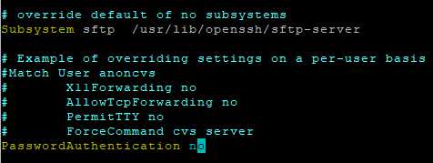

SSH Authentication config
===========================

## 1. create ssh key on client (ssh-keygen)

 ### Flags:

>-t = type, select algorithm  
>-e = export, reformat  
>-f, = filename/location  
>-c, = comment  
>-b = bits, key size  
>-p = change passphrase(-N, new;-P, old)  
>-i, = input  
>-q, = silent ssh  

### input

>ssh-keygen -t rsa -b 4096 -C "comment"

## 2.1 copy public key to ubuntu server (ssh-id-copy)

### command

>ssh-copy-id "username@remote_host"

## 2.2 copy public key to ubuntu server (ssh, used if no ssh-id-copy)

### input

>cat ~/.ssh/id_rsa.pub | ssh username@remote_host "mkdir -p ~/.ssh && touch ~/.ssh/authorized_keys && chmod -R go= ~/.ssh && cat >> ~/.ssh/authorized_keys"

## 3.1 check that user has sudo privileges

### input

>id "username"

If the user is not in the sudo group on remote-server input the following

>sudo usermod -aG sudo "username"

## 3.2 disable password authentication

### input

>sudo vim /etc/ssh/sshd_config

un-comment PasswordAuthentication and set it no "no"

## 4 restart ssh service

### input

>sudo service ssh restart

## Failed attempt to connect without pub key

### output

<pre>
test@hv-ubnt02:~$ ssh user1@192.168.22.139 -p 22
The authenticity of host '192.168.22.139 (192.168.22.139)' can't be established.
ED25519 key fingerprint is SHA256:hhNG05OeTVyok63zhYF4VeNWSQFwL2G22dZbPw3pFEY.
This key is not known by any other names
Are you sure you want to continue connecting (yes/no/[fingerprint])? yes
Warning: Permanently added '192.168.22.139' (ED25519) to the list of known hosts.
user@192.168.22.139: Permission denied (publickey).
</pre>

not able to connect, pubkeyAuthentication is working